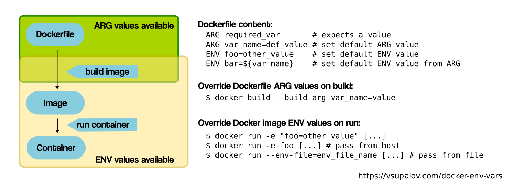

# Docker

## Docker networks problem

I often have problems with the docker daemon, not on the first fresh installation but for example after installing another version over one another etc.
Suddently i can't access the upper network as i did.

some articles explain what to do in this kind of problem with iptables, reseting iptables rules and restarting the docker daemon seems to resolve my problem :

````shell
sudo iptables -P INPUT ACCEPT
sudo iptables -P FORWARD ACCEPT
sudo iptables -P OUTPUT ACCEPT
sudo iptables -t nat -F
sudo iptables -t mangle -F
sudo iptables -F
sudo iptables -X
````

## Docker build args



Build args recquire the use of the `ARG` key word in each layer build of the ``Dockerfile``

Here is an example of a dotnet service image

````dockerfile
#See https://aka.ms/containerfastmode to understand how Visual Studio uses this Dockerfile to build your images for faster debugging.

FROM mcr.microsoft.com/dotnet/aspnet:3.1 AS base
WORKDIR /app
EXPOSE 80

FROM mcr.microsoft.com/dotnet/sdk:3.1 AS build
ARG RELEASE_TYPE=Debug
WORKDIR /src
COPY ["Identity/API/Identity.API/Identity.API.csproj", "Identity/API/Identity.API/"]
COPY ["Identity/Infrastructure/Identity.Infrastructure/Identity.Infrastructure.csproj", "Identity/Infrastructure/Identity.Infrastructure/"]
COPY ["BuildingBlocks/BuildingBlocks.Infrastructure/BuildingBlocks.Infrastructure.csproj", "BuildingBlocks/BuildingBlocks.Infrastructure/"]
COPY ["Identity/Application/Identity.Application/Identity.Application.csproj", "Identity/Application/Identity.Application/"]
COPY ["Identity/API/Identity.API.Models/Identity.API.Models.csproj", "Identity/API/Identity.API.Models/"]
RUN dotnet restore "Identity/API/Identity.API/Identity.API.csproj"
COPY . .
WORKDIR "/src/Identity/API/Identity.API"
RUN dotnet build "Identity.API.csproj" -c ${RELEASE_TYPE} -o /app/build

FROM build AS publish
ARG RELEASE_TYPE=Debug
RUN dotnet publish "Identity.API.csproj" -c ${RELEASE_TYPE} -o /app/publish

FROM base AS final
WORKDIR /app
COPY --from=publish /app/publish .
ENTRYPOINT ["dotnet", "Identity.API.dll"]
````

### default networks

recreate the docker bridge interface

````json
{
  "hosts": [ "tcp://0.0.0.0:2375" ],
  "selinux-enabled": true,
  "default-address-pools":
  [
    {"base":"10.10.0.0/16","size":24}
  ]
}
````

````shell
nheim@debian:~$ ip link delete docker0
RTNETLINK answers: Operation not permitted
nheim@debian:~$ sudo ip link delete docker0
````

it repaired the internal connectivity

````shell
nheim@debian:~$ docker run -it debian:bullseye-slim
root@e5fb4d58503f:/#
root@e5fb4d58503f:/#
root@e5fb4d58503f:/# apt update
Get:1 http://deb.debian.org/debian bullseye InRelease [116 kB]
Get:2 http://security.debian.org/debian-security bullseye-security InRelease [44.1 kB]
Get:3 http://deb.debian.org/debian bullseye-updates InRelease [39.4 kB]
Get:4 http://security.debian.org/debian-security bullseye-security/main amd64 Packages [146 kB]
Get:5 http://deb.debian.org/debian bullseye/main amd64 Packages [8182 kB]
Get:6 http://deb.debian.org/debian bullseye-updates/main amd64 Packages [2596 B]
Fetched 8530 kB in 2s (3781 kB/s)
Reading package lists... Done
Building dependency tree... Done
Reading state information... Done
All packages are up to date.

````
### References

- https://vsupalov.com/docker-env-vars/