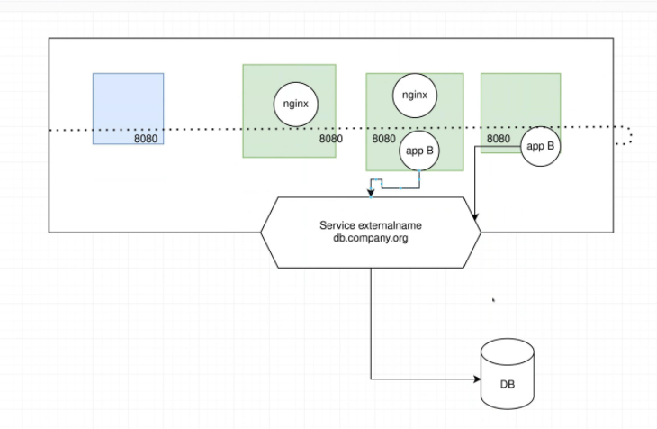
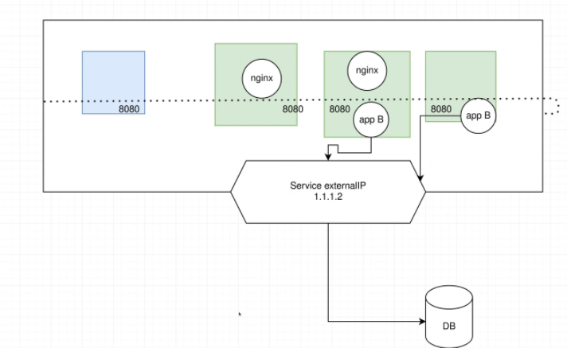

#
## application ready

- systeme de contrôle de version
- réutilisation du code => librairie
  - management de librairie
- faciliter l'installation 
- ne pas se dire que la dépendance existe dans le container
- ne cpas compter sur l'utilisation d'outil implicite
- pas de hardcode pour la config, les identifiants etc ...
- variables d'environnement ou fonctionnalité kubernetes
  - configmap => secrets

- backing service => ensemble de microservices
  - propose une api ou des commandes

build + configuration = ralease
Run => exécuter l'application dans l'environnement d'exécution

## Process

partage entre process => utilisation de backing service
distribution de stockage mais pas forcement optimale

## Port Binding

- association de ports faite au démarrage
- une couche de routage gère les demandes du nom d'hote vers le processus lé au port

## Concurrency

- tâche de background séparés sinon blockage
- en stateless le scaling horizontal est possible => plus d'instance
- horizontal  => plus d'instance
- vertical => plus de puissance

## Disposability

VM préemty
gérer gracefull kill (30 sec) avant le sigkill (corruption etc ...)


## DEV/PROD Parity

- nouveau code écrit => feedback loop raccourci
- rolling update (déploiement progressif)
- environements ISOmétriques
- même backing service DEV/PROD
- point d'entrée de test (smtp) par exemple en test que en prod
- avoir le même comportement au max des backing service

## Logs

- traiter les logs comme un flux d'événements
- logger sur un endpoint les logs

## Admin process

- migration db
- one time scripts

livrer les one time scripts avec le reste du code ou en tout cas associé

## Mircorservices

plus facile à gérer, créer, maintenance plus facile

## Benefits

- indépendances des développeurs/composants
- résilience: si un composant meurs, possibilité d'éxécuter une version sauvegardée
- plus facile de mètre en oeuvre le CI/CD
- domaine split business

## Archi

- composants de plusieurs versions déployés ensemble
- utilisation de techno de conteuneurisation

## Docker 

- image => modèle en lecture seule
- conteuneur => instance exécutable
- récréation depuis un état courant possible comme un snapshoot
- bien configurer la sécurité pour éviter les failles

le conteuneur peut être paramétrer soit au build time soit à l'éxécution (pas forcement tout)


## services docker

mise à l'échelle
chaque membre du swarm est un daemon Docker
utilisation des services docker lors de l'utilisation de 


## Kubes

- Conteneurs de monitoring
- orchestration

- ne build pas le code source
- ne fournis pas de middleware
- libre d'utiliser les solutions de logging / monitoring alerting
- orchestrateur déclaratif
- possibilité de décider des étapes de convergences du cluster

## Notions

### Node

serveur physique ou virtuel

### Pods

groupe de 1 ou plusieurs conteuneurs (unité de conteuneur Kubernete)
### Service

abstraction de la couche réseau (éviter utilisation des ip)
    - DNS interne
    - Volume => permet l'échange des données, persistant ou efémère

### Deployment

déclaration pour un manager de déploiement, créer effacer ou scaling d'application/des pods

### Namespace

Cluster dans le cluster (virtuel)
Uniformité et séparation des resources

## Exo Docker
### Run à la création de l'image
CMD != RUN

## install kube

http://meetingwords.com/44zCobvUcU

===== Installation sur tous les noeuds as root

swapoff -a

vim /etc/fstab

apt-get update && apt-get install -y apt-transport-https curl

curl -s https://packages.cloud.google.com/apt/doc/apt-key.gpg | apt-key add -

sudo add-apt-repository "deb http://apt.kubernetes.io/ kubernetes-xenial main"

sudo apt-get update && sudo apt-get install -y kubelet kubeadm kubectl kubernetes-cni

systemctl enable kubelet

kubeadm init --apiserver-advertise-address=192.168.0.40 --node-name $HOSTNAME --pod-network-cidr=10.244.0.0/16

root@ubuntu1604:/home/vagrant/docker_install# kubeadm reset
[reset] Reading configuration from the cluster...


Si jamais token perdu :
sudo kubeadm token create --print-join-command

utiliser la commande de join depuis les worker en sudo.

============= A utiliser que si probleme =======
kubectl apply -f https://raw.githubusercontent.com/coreos/flannel/master/Documentation/kube-flannel.yml

====== Sur virtualbox UNIQUEMENT

Editer /etc/hosts 
remplacer 127.0.1.1 -> ip du nod


### fichier config 

comme une clef SSH

kubectl login


## Archi

### cloud-contrôler 

n'existe que lors de l'utilisation d'un

### controle plane

ensemble des master du cluster
ne pas utiliser pour les pods, ne pas "détainter"

etcd => seul à sauvegarder pour répliquer le cluster il contient les ConfigMap

possibilité de gérer automatiquement avec cloud controller 
les regles doivent rester possible sinon pas d'auto gestion (ex : aucun noeud ne permet les contraintes précisés )

la liste des pods est gérée automatiquement et l'URL du endpoint est fournie

## Cloud controller manager

spécifique au cloud, check de la disponibilité des VM préempty (preemptible)

## composant

### kubelet

s'assure du fonctionnement des pods, tourne sur le master et les nodes

### Kube-proxy

gère les communications depuis l'intérieur ou l'extérieur


## deploy

kubectl create deployment nginx --image nginx
kubectl get deployment

describe => premier reflexe à avoir pour résoudre les problèmes

## service

### NodePort
expose via un port à l'extérieur du cluster
peu importe la machine sur laquel on va le port sera connecté

chaque noeud aura un proxy du port vers votre service

possibilité de forcer le port mais gestion de la colision à gérer à la main

metal LB

permet de repartir la charge, si plusieurs pods duplicats existent kubernete va gérer la charge correctement

### LoadBalancer
export avec un cloud provider LB

### ClusterIP
exposition interne au cluster

### ExtrernalName
Expose à l'exterieur du cluster






vagrant@kubmaster:~$ kubectl get pods -A
NAMESPACE         NAME                                READY   STATUS    RESTARTS   AGE
default           nginx-6799fc88d8-c6zcd              1/1     Running   0          33m
kube-system       coredns-78fcd69978-9sfcs            1/1     Running   0          123m
kube-system       coredns-78fcd69978-bq9qp            1/1     Running   0          123m
kube-system       etcd-kubmaster                      1/1     Running   0          123m
kube-system       kube-apiserver-kubmaster            1/1     Running   0          123m
kube-system       kube-controller-manager-kubmaster   1/1     Running   0          123m
kube-system       kube-flannel-ds-jfp26               1/1     Running   0          110m
kube-system       kube-flannel-ds-m57xb               1/1     Running   0          110m
kube-system       kube-proxy-5j6t6                    1/1     Running   0          121m
kube-system       kube-proxy-kr2f8                    1/1     Running   0          123m
kube-system       kube-scheduler-kubmaster            1/1     Running   0          123m
tigera-operator   tigera-operator-6fbb48778f-lkqwr    1/1     Running   0          123m


vagrant@kubmaster:~$ kubectl delete pod --all -n kube-system
pod "coredns-78fcd69978-9sfcs" deleted
pod "coredns-78fcd69978-bq9qp" deleted
pod "etcd-kubmaster" deleted
pod "kube-apiserver-kubmaster" deleted
pod "kube-controller-manager-kubmaster" deleted
pod "kube-flannel-ds-jfp26" deleted
pod "kube-flannel-ds-m57xb" deleted
pod "kube-proxy-5j6t6" deleted
pod "kube-proxy-kr2f8" deleted
pod "kube-scheduler-kubmaster" deleted
vagrant@kubmaster:~$ 


agrant@kubmaster:~$ kubectl create service nodeport nginx --tcp=8888:80
service/nginx created
vagrant@kubmaster:~$ kubectl get service
NAME         TYPE        CLUSTER-IP      EXTERNAL-IP   PORT(S)          AGE
kubernetes   ClusterIP   10.96.0.1       <none>        443/TCP          127m
nginx        NodePort    10.104.249.95   <none>        8888:32026/TCP   13s
vagrant@kubmaster:~$ kubectl describe service nginx
Name:                     nginx
Namespace:                default
Labels:                   app=nginx
Annotations:              <none>
Selector:                 app=nginx
Type:                     NodePort
IP Family Policy:         SingleStack
IP Families:              IPv4
IP:                       10.104.249.95
IPs:                      10.104.249.95
Port:                     8888-80  8888/TCP
TargetPort:               80/TCP
NodePort:                 8888-80  32026/TCP
Endpoints:                10.244.1.4:80
Session Affinity:         None
External Traffic Policy:  Cluster
Events:                   <none>


## install ace

kubeadm init --apiserver-advertise-address=10.10.17.72 --node-name xp1.acedigitale.local

## Rappel

Plusieurs instance d'un serveur peuvent tourner sur le même noeud

kubectl get pods -owide

````
vagrant@kubmaster:~$ kubectl get pods -owide
NAME                     READY   STATUS    RESTARTS   AGE   IP               NODE      NOMINATED NODE   READINESS GATES
nginx-6799fc88d8-zsqm9   1/1     Running   0          16h   10.244.153.193   kubnode   <none>           <none>
vagrant@kubmaster:~$*
````

## questions

on peux faire tourner tout les 
1 deploiement = 1 ou plusieurs PODS
ClusterIP est le type de service par defaut
horizontal scaling : multiplier les instances
vertical scaling : 

crash monomaster :
les applications continues de fonctionner

kube controler manager => détecte les noeuds morts

````
kubectl -f logs
kubectl exec -ti xxxx

vagrant@kubmaster:~$ kubectl api-resources
NAME                              SHORTNAMES   APIVERSION                             NAMESPACED   KIND
bindings                                       v1                                     true         Binding
componentstatuses                 cs           v1                                     false        ComponentStatus
configmaps                        cm           v1                                     true         ConfigMap
endpoints                         ep           v1                                     true         Endpoints
events                            ev           v1                                     true         Event
````

## reference API

``kubectl explain <resource>``

comment chercher efficacement les pamramètres pour les fichiers de configuration
permet d'aider à structurer les déclaration des fichiers de configuration

<https://kubernetes.io/docs/reference/generated/kubernetes-api/v1.22/>

## configuration

utilisation du yaml par defaut

simplifer, versionner etc ...
utilisation de helm

kube va "converger" vers l'état 

### HELM

helm génération de yaml
permet d'utiliser des templates
utilisation d'un registry HELM
helm install
utilisation si beaucoup de resources
gouffre de helm ?
ex : helm install gitlab

utiliser -ojson ou -oyaml pour avoir une sortie formatée

## Utilisation du namespace

exemple pour : DEV/PROD/PREPROD
ou par application

``kubectl get  ns``

utilisation en interne de <service>.<namespace>.svc.cluster.local
curl http://nginx.default.svc.cluster.local pas utilisable à l'extérieur du cluster

## Annotation Label

Annotation utilisation externe
Label utilisation interne

````
vagrant@kubmaster:~$ kubectl get pods --show-labels
NAME                      READY   STATUS    RESTARTS   AGE   LABELS
nginx1-b97c459f7-67vvt    1/1     Running   0          62s   app=nginx1,pod-template-hash=b97c459f7
nginx2-5fc4444698-p6dsm   1/1     Running   0          57s   app=nginx2,pod-template-hash=5fc4444698
nginx3-5465449d99-cmtrs   1/1     Running   0          52s   app=nginx3,pod-template-hash=5465449d99

vagrant@kubmaster:~$ kubectl get deployment --show-labels
NAME     READY   UP-TO-DATE   AVAILABLE   AGE    LABELS
nginx1   1/1     1            1           2m1s   app=nginx1
nginx2   1/1     1            1           116s   app=nginx2
nginx3   1/1     1            1           111s   app=nginx3
````

kubectl get deployment nginx3 "usage=front"
kubectl get deployment nginx3 "usage-"
kubectl label --overwrite prod nginx <pod> "

le deployment gère un replicaset

utilisation des selector pour l'unicité, ou recherche par tag

````
kubectl get pods --selector "app=nginx" --show-labels
kubectl get pods --selector "app in (nginx1, nginx2 )" --show-labels
````

Utilisation possible de localhost pour échanger dans les containers dans le même pod

## Sets

### DaemonSets
monitoring

### StatefullSet
storage

### ManagerSet

````
Pas le droits de changer brutalement l'intégrité d'un container qui tourne
suppression + creation

vagrant@kubmaster:~$ kubectl delete -f ./formation_kube/desc.kub.yaml 
pod "pod-test" deleted
vagrant@kubmaster:~$ 
vagrant@kubmaster:~$ kubectl apply -f ./formation_kube/desc.kub.yaml 
pod/pod-test created
vagrant@kubmaster:~$ kubectl get pods
NAME       READY   STATUS      RESTARTS   AGE
pod-test   0/1     Completed   0          6s
vagrant@kubmaster:~$ kubectl get pods -f ./formation_kube/desc.kub.yaml 
error: when paths, URLs, or stdin is provided as input, you may not specify resource arguments as well
vagrant@kubmaster:~$ kubectl -f ./formation_kube/desc.kub.yaml get pods
error: when paths, URLs, or stdin is provided as input, you may not specify resource arguments as well
vagrant@kubmaster:~$ kubectl get pods
NAME       READY   STATUS      RESTARTS   AGE
pod-test   0/1     Completed   2          43s
vagrant@kubmaster:~$ kubectl get pods
NAME       READY   STATUS      RESTARTS   AGE
pod-test   0/1     Completed   2          47s
vagrant@kubmaster:~$ kubectl get pods
NAME       READY   STATUS      RESTARTS   AGE
pod-test   0/1     Completed   2          48s
vagrant@kubmaster:~$ 
````

## Persistence

Besoin de stockage aussi bas que possible
fichier de conf par config map
Secrets

### StatefullSet
  - effemère
  - persistent


### Volumes
hostPath: partage entre le Pod et le Host
emptyDir: non persistent mais permet des échanges entre les containers du Pod
persistentVolumeClaim: stockage par les cloud providers
external: NFS, Volumeclaim, Ceph

d'autres types :
- secret
- local
- configmap

DaemonSet: 1 pod par node

### HostPath

types de volumes:
 DirectoryOrCreate | Directory
 FileOrCreate | File
 Socket
 CharDevice

### EmptyDir

non persistant mais possibilité de monter en ram

edition directe de ressource :

````
vagrant@kubmaster:~/formation_kube$ kubectl edit service nginx
Edit cancelled, no changes made.
vagrant@kubmaster:~/formation_kube$
````

## Jobs

tâches poncuelles, job complet lors d'un retour en succès, pods possibles en parrallèle

### Ecrire un job

similaire à une ressource mais pas besoin de kind et apiVersion, Ex:
completions:9
paralelism:5

### CronJobs

comme les jobs doivent être idempotent et non dépendants d'un état
spec.startingDeadlineSeconds ne pas démarrer si c'est trop tard, si fenêtre de tir loupé
comptage du nombre de schedule

### ConcurrencyPolicy

spec.concurrencyPolicy
- Allow: default
- Forbid
- Replace

spec.successfullJobsHistoryLimit pareil pour le fail

````
vagrant@kubmaster:~/formation_kube$ kubectl apply -f ./cronjob.yaml 
Warning: batch/v1beta1 CronJob is deprecated in v1.21+, unavailable in v1.25+; use batch/v1 CronJob
cronjob.batch/hello created
vagrant@kubmaster:~/formation_kube$ 
vagrant@kubmaster:~/formation_kube$ 
vagrant@kubmaster:~/formation_kube$ kubectl get pod
NAME    READY   STATUS    RESTARTS      AGE
nginx   2/2     Running   5 (94s ago)   53m
vagrant@kubmaster:~/formation_kube$ kubectl get cronjob
NAME    SCHEDULE      SUSPEND   ACTIVE   LAST SCHEDULE   AGE
hello   */1 * * * *   False     1        9s              33s
vagrant@kubmaster:~/formation_kube$ 
vagrant@kubmaster:~/formation_kube$ kubectl get pods
NAME                      READY   STATUS              RESTARTS       AGE
hello-27193824--1-5q8dr   0/1     Completed           0              71s
hello-27193824--1-cfrzs   0/1     Completed           0              76s
hello-27193824--1-h7pb5   0/1     Completed           0              66s
hello-27193824--1-jjxhb   0/1     Completed           0              86s
hello-27193824--1-m5crm   0/1     Completed           0              80s
hello-27193824--1-zqq5z   0/1     Completed           0              62s
hello-27193825--1-2n829   0/1     Completed           0              13s
hello-27193825--1-4s8nm   0/1     Completed           0              8s
hello-27193825--1-6jlrf   0/1     Completed           0              22s
hello-27193825--1-6n77k   0/1     Completed           0              26s
hello-27193825--1-nm88h   0/1     Completed           0              17s
hello-27193825--1-zg7zw   0/1     ContainerCreating   0              3s
nginx                     2/2     Running             5 (3m5s ago)   54m
vagrant@kubmaster:~/formation_kube$ 
````

````yaml
apiVersion: batch/v1beta1
kind: CronJob
metadata:
  name: hello
spec:
  schedule: "*/1 * * * *" #@hourly
  startingDeadlineSeconds: 10
  concurrencyPolicy: Allow
  successfulJobsHistoryLimit: 1
  failedJobsHistoryLimit: 5
  jobTemplate:
    # -------JOB YAML -------------
    spec:
      completions: 6
      template:
        # -------POD YAML -------------
        spec:
          containers:
          - name: hello
            image: busybox
            args:
            - /bin/sh
            - -c
            - date; echo Hello from the Kubernetes cluster
          restartPolicy: OnFailure
````

## replicaSet

lister : kubectl get rs

- attached cronjob : avec les specifification du pod
- detached cronjob : sans les specification du pod (se base sur des ressources existantes)


## controleur d'ingress

exposer le port 443 de toutes les machines, routing par rapport au nom de domaine, type de nginx companion

## deploiement

jouer sur les labels pour le deploiement
le service pourrai avoir deux label qui redirigent aleatoirement vers les pod labellisés similairement

## ConfigMap

contralize, ameliorer et manager les configurations
isoler, sécuriser, manipuler ou partager les configmap

### secret

secret chiffré dans le cluster et déchiffré de la vue du pod
attention si les utilisateurs ont accès aux logs peuvent accéder aux secret affichés dans les logs

dans les secrets/git on place des placeholder et la CI peux les remplacer

### Exo

==== JOUR 3

--- configmaps/secrets

kubectl create cm test --from-literal=user=admin
kubectl get cm

yaml references possibles avec des anchors

utilisation de plusieur --from-file

montage pour le pod dans volume ou variable d'env

### Exo2

````
vagrant@kubmaster:~/formation_kube$ kubectl apply -f ./configmap1.yaml 
configmap/my-cm created
vagrant@kubmaster:~/formation_kube$ kubectl apply -f ./pod01.yaml 
pod/busybox created
vagrant@kubmaster:~/formation_kube$ kubectl exec busybox -- env
PATH=/usr/local/sbin:/usr/local/bin:/usr/sbin:/usr/bin:/sbin:/bin
HOSTNAME=busybox
USER=echo
KUBERNETES_PORT_443_TCP_ADDR=10.96.0.1
NGINX_SERVICE_HOST=10.96.97.191
NGINX_SERVICE_PORT_8888_80=8888
KUBERNETES_SERVICE_PORT=443
KUBERNETES_PORT_443_TCP_PROTO=tcp
NGINX_PORT=tcp://10.96.97.191:8888
NGINX_PORT_8888_TCP_PORT=8888
KUBERNETES_SERVICE_HOST=10.96.0.1
KUBERNETES_SERVICE_PORT_HTTPS=443
KUBERNETES_PORT=tcp://10.96.0.1:443
KUBERNETES_PORT_443_TCP_PORT=443
NGINX_PORT_8888_TCP=tcp://10.96.97.191:8888
NGINX_PORT_8888_TCP_PROTO=tcp
KUBERNETES_PORT_443_TCP=tcp://10.96.0.1:443
NGINX_SERVICE_PORT=8888
NGINX_PORT_8888_TCP_ADDR=10.96.97.191
HOME=/root
vagrant@kubmaster:~/formation_kube$
````

addon traefik pour ingress
certificats etc

traefik dashboard


## accès par keys 

````yaml
apiVersion: v1
kind: Pod
metadata:
  name: busybox
spec:
  containers:
  - name: test-secret
    image: k8s.gcr.io/busybox
    args:
    - /bin/sh
    - -c
    - sleep 600
    env:
    - name: USERNAME
      valueFrom:
        secretKeyRef:
          name: my-secret
          key: user
    - name: PSSWD
      valueFrom:
        secretKeyRef:
          name: my-secret
          key: password
````

## accès à toutes valeurs

````yaml
apiVersion: v1
kind: Pod
metadata:
  name: busybox
spec:
  containers:
  - name: test-secret
    image: k8s.gcr.io/busybox
    args:
    - /bin/sh
    - -c
    - sleep 600
    envFrom: #Use all the Secret as env
    - secretRef:
        name: my-secret
````


## forcer la suppression des pods

vagrant@kubmaster:~$ kubectl delete pods --all --grace-period=0 --force
warning: Immediate deletion does not wait for confirmation that the running resource has been terminated. The resource may continue to run on the cluster indefinitely.
pod "hello-27193837--1-q74mk" force deleted
pod "hello-27193880--1-sfzcx" force deleted
pod "hello-27193899--1-rtlpg" force deleted
pod "hello-27193902--1-rnb2r" force deleted
pod "hello-27193926--1-vj2nt" force deleted
pod "hello-27193953--1-7lzq4" force deleted
pod "hello-27194015--1-7v8bf" force deleted
pod "hello-27194924--1-spfp7" force deleted


## Deployment

Deployment => replicat => pod => container

types : 
- RollingUpdate : strategie d'update graduelle
- Recrete: Detruit v1, recrée v2 (Brutal), utilisé pour les ingress par exemple car l'utilisation d'un port ne peux être que unique

### Avancée (necessite addon)
- Blue/Green: Dupliquer la stack, la tester, basculer le service vers la nouvelle
- Canary Deployment: Envoi d'un % du trafic vers la nouvelle version, une fois validée, migration (ISTIO)


### Options

- progressDeadlineSeconds: Combien de fois avant de signaler que la mise à jour progressive a échoué (600s)


### Failures

- insufficient Quota: possibilité de faire un quota par namespace par exemple
- readiness probe failures
- Image pull errors
- Insufficient permissions
- Limit Ranges (ressemble au Quota)
- Application Runtime Misconfiguration (Interface chaise clavier)

même en fail possibilité de  faire du scale, rollback pause, spec.revisionHistoryLimit

### Health Check

type:

- Liveness: restart du pod si fail
  - backoff avec timer
- Readiness: si échoue le service n'envoie plus de traffic

les deux sont complémentaires

#### comment ?

- commande: exec
- Http: httpGet
- TCP: tcpSocket


- initialDelaySeconds: Quand on damarre
- periodSeconds
- timeoutSeconds
- successThreshold
- failureThreshold


## Deployment

Strategy de rooling update, surge, max unavaillable, pourcentage ou nombre entier
25% par defaut

apply du deploiement

````
apiVersion: apps/v1
kind: Deployment
metadata:
  name: nginx-deployment
  labels:
    app: nginx
spec:
  replicas: 3
  selector:
    matchLabels:
      app: nginx
  template:
    metadata:
      labels:
        app: nginx
    spec:
      containers:
      - name: nginx
        image: registry.gitlab.onlineterroir.com/omega/public-reg/nginx:1.14.2
        ports:
        - containerPort: 80
````
on garde les replicas pour pouvoir rollbacker

````
vagrant@kubmaster:~/formation_kube$ kubectl get all --show-labels
NAME                                    READY   STATUS    RESTARTS   AGE   LABELS
pod/nginx-deployment-597f98df44-22bws   1/1     Running   0          11m   app=nginx,pod-template-hash=597f98df44
pod/nginx-deployment-597f98df44-2tdjx   1/1     Running   0          11m   app=nginx,pod-template-hash=597f98df44
pod/nginx-deployment-597f98df44-7bg8v   1/1     Running   0          11m   app=nginx,pod-template-hash=597f98df44
pod/nginx-deployment-597f98df44-r7dl5   1/1     Running   0          11m   app=nginx,pod-template-hash=597f98df44
pod/nginx-deployment-597f98df44-r9nps   1/1     Running   0          11m   app=nginx,pod-template-hash=597f98df44
pod/nginx-deployment-597f98df44-sgnbd   1/1     Running   0          12m   app=nginx,pod-template-hash=597f98df44
pod/nginx-deployment-597f98df44-w64w5   1/1     Running   0          12m   app=nginx,pod-template-hash=597f98df44
pod/nginx-deployment-597f98df44-xwpdl   1/1     Running   0          12m   app=nginx,pod-template-hash=597f98df44

NAME                 TYPE        CLUSTER-IP     EXTERNAL-IP   PORT(S)          AGE   LABELS
service/kubernetes   ClusterIP   10.96.0.1      <none>        443/TCP          46h   component=apiserver,provider=kubernetes
service/nginx        NodePort    10.96.97.191   <none>        8888:30983/TCP   21h   app=nginx

NAME                               READY   UP-TO-DATE   AVAILABLE   AGE   LABELS
deployment.apps/nginx-deployment   8/8     8            8           12m   app=nginx

NAME                                          DESIRED   CURRENT   READY   AGE   LABELS
replicaset.apps/nginx-deployment-597f98df44   8         8         8       12m   app=nginx,pod-template-hash=597f98df44

````


### health check

````yaml
apiVersion: v1
kind: Pod
metadata:
  labels:
    test: liveness
  name: liveness-exec
spec:
  containers:
  - name: liveness
    image: k8s.gcr.io/busybox
    args:
    - /bin/sh
    - -c
    - touch /tmp/healthy; sleep 30; rm -rf /tmp/healthy; sleep 600
    livenessProbe:
      exec:
        command:
        - cat
        - /tmp/healthy
      initialDelaySeconds: 5
      periodSeconds: 5
````

evenements sur les health check avec un 
``kubectl describe pod <podname>``

utilisation de startup probe

## history de deploy

kubectl rollout status deploy nginx-deployment
kubectl rollout history deploy nginx-deployment

## pause/resume de deploy

kubectl rollout pause deploy nginx-deployment
kubectl rollout resume deploy nginx-deployment

kubectl rollout resume deploy nginx-deployment
kubectl rollout undo deploy nginx-deployment --to-revision X


## global

- ne pas definir les config si config par default
- utiliser les annotations pour suivre les deploiements
- injecter les variables d'environnement à l'aide des config maps
- éviter au max de fixer les IP
- pour debug possibilité d'utiliser un kubetcl port-forward
- eviter de spécifier le port hostport