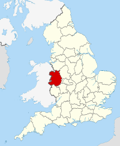

# Théorie de Lamarck
## Jean-Baptiste Lamarck
Jean-Baptiste Lamarck est né le 1 er Aout 1744 à Bazentin en picardie (France) et mort en 1918
.jpg)

## Théorie (transformations évolutives)
Selon ma compréhension Lamarck défendais une théorie de l'évolution qui définissais une évolution plustôt active qui, suite à des contraintes exercées sur déferentes parties du corps ou des organes permétaient de transformer celui-ci. La transformation pouvais, semblerait-il aller jusqu'a un niveau génétique (mémoire épigénétique ou effet transgénérationnel) et ainsi pouvais persister plusieurs générations.
## Référence :
- https://en.wikipedia.org/wiki/Jean-Baptiste_Lamarck

# Théorie de Darwin/Wallace
## Darwin et Wallace
Darwin né le 12 Février 1809 en Angleterre et mort le 19 Avril 1882

Wallace (amis proche de Darwin) né le 8 janvier 1823 en Angleterre et mort le 7 Novembre 1913
## Théorie  (transformations)
Pour moi les transformations vues par Darwin et Wallace sont des transformations passives conséquentes à l'élimination d'une souche d'individus (faibles face à leur environnement) seuls les indivudus les plus adaptés survivent et une particularité génétique pourrai être amplifiée suite à une forte adaptation à l'environnement.

# Mon point de vue
Les deux points de vue concernant l'évolutions sont clairement divergents mais, en restant cloisoné à ces simples parties, les deux éléments peuvent êtres complémentaires. ex : Un individu qui s'adaptera mieux et plus rapidement aura une facilité d'adaptation face aux changements rapides de l'environnement et ainsi pourrai mieux survivre suite au "passage" de la sélection naturelle.
Je ne suis pas d'accord en ce qui concerne ceux qui enlèvent du credit à Darwin tout crédit à Darwin depart l'existance (50 ans avant) des travaux de Lamarck. Je suis en revanche egalement persuadé que les travaux de Lamarck on influencés d'une façon ou d'une autre ceux de Darwin et Wallace.

# Références:
- https://www.encyclopedie-environnement.org/vivant/lamarck-darwin-deux-visions-divergentes-monde-vivant/
- https://en.wikipedia.org/wiki/Charles_Darwin