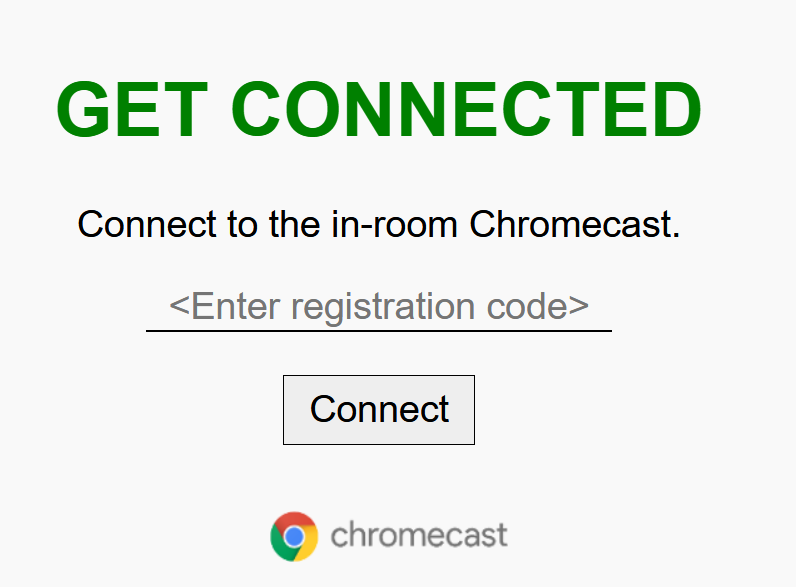

# freebox and vpn

i'm in holidays and i need a VPN in france ... the molotov program tell we have to pay in any "european use" ...

the freebox mini has a cool option to provide a VPN server connection but i had some problem because the configuration do not work "out of the box" the topology is not well defined and other problems :

## the hotel network

The hotel has a cool way of providing the chromecast service to the rooms using the "Otrum" tool you connect to a local URL http://tv.myvinn.com and it serves an interface like  after you enter the pairing code, your devices connected to the hotel wifi can easily see the chromecast equipment to cast to.

http://tv/myvinn.com is sdfdsf

````shell
C:\git\wikijs>ping tv.myvinn.com

Envoi d’une requête 'ping' sur tv.myvinn.com [172.20.0.11] avec 32 octets de données :
Réponse de 172.20.0.11 : octets=32 temps=2 ms TTL=64
````
## working chrome casting routing table

````shell
IPv4 Table de routage
===========================================================================
Itinéraires actifs :
Destination réseau    Masque réseau  Adr. passerelle   Adr. interface Métrique
          0.0.0.0          0.0.0.0       172.20.0.1     172.20.7.200     45
         10.0.0.0    255.255.255.0         On-link         10.0.0.11    281
        10.0.0.11  255.255.255.255         On-link         10.0.0.11    281
       10.0.0.255  255.255.255.255         On-link         10.0.0.11    281
      51.77.212.1  255.255.255.255         10.0.0.1        10.0.0.11    281
        127.0.0.0        255.0.0.0         On-link         127.0.0.1    331
        127.0.0.1  255.255.255.255         On-link         127.0.0.1    331
  127.255.255.255  255.255.255.255         On-link         127.0.0.1    331
       172.17.0.0      255.255.0.0         10.0.0.1        10.0.0.11    281
       172.18.0.0      255.255.0.0         10.0.0.1        10.0.0.11    281
       172.20.0.0    255.255.240.0         On-link      172.20.7.200    301
     172.20.7.200  255.255.255.255         On-link      172.20.7.200    301
    172.20.15.255  255.255.255.255         On-link      172.20.7.200    301
    192.168.159.0    255.255.255.0         On-link     192.168.159.1    291
    192.168.159.1  255.255.255.255         On-link     192.168.159.1    291
  192.168.159.255  255.255.255.255         On-link     192.168.159.1    291
        224.0.0.0        240.0.0.0         On-link         127.0.0.1    331
        224.0.0.0        240.0.0.0         On-link     192.168.159.1    291
        224.0.0.0        240.0.0.0         On-link         10.0.0.11    281
        224.0.0.0        240.0.0.0         On-link      172.20.7.200    301
  255.255.255.255  255.255.255.255         On-link         127.0.0.1    331
  255.255.255.255  255.255.255.255         On-link     192.168.159.1    291
  255.255.255.255  255.255.255.255         On-link         10.0.0.11    281
  255.255.255.255  255.255.255.255         On-link      172.20.7.200    301
===========================================================================
````

## Reference

https://forum.freenews.fr/index.php?topic=117463.0