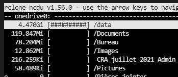

# Rclone

the perfect tool to synchronize your cloud drives and more.

* many connectivities functions added during last years, Azure (OneDrive), Google Drive (Photos), simple FTP and many more
* You can very easily manage (with an advanced configuration), synchronize multiple account.
* You can mount each drive as filesystems with the fuse functionalities

the only thing required is to authenticate and configure each access to the storage ressources before using

## Notes

use the ``--fast-list`` parameter to increase speed (if cloud drive support it)

### References
* https://forum.rclone.org/t/syncing-up-to-google-drive-speed-with-lots-of-files/11999
## OAuth and tokens

to authenticate you should use a "desktop" version of the rclone binary (which can run a web browser used to simplify the authentification)
i think it's also possible to connect using a SSH tunnel using VSCode for exemple or create a tunel manualy
at the moment i see the token expiration date are fixed to something like one month, i found a post telling rclone refresh the tokens automatically but wait and see ...
### more advanced OAuth functionalities

There are some advanced OAuth fonctionalities to use a client_id/secret for authentification and create a long run authentification.
#### Get a refresh token from Google
you can use this developer tool to get a refresh token (long run token) https://developers.google.com/oauthplayground/
##### References
* https://github.com/ivanvermeyen/laravel-google-drive-demo/blob/master/README/2-getting-your-refresh-token.md


#### References

* https://forum.rclone.org/t/onedrive-client-id-secret-not-working/22630/15
* https://filemanagerpro.io/article/how-can-i-get-my-microsoft-account-client-id-and-client-secret-key/
* https://portal.azure.com/#blade/Microsoft_AAD_RegisteredApps/ApplicationsListBlade
## Exemples
mounting one drive with rclone :

````
rclone mount one_drive_pay:/data/ /mnt/one_drive_pay/ --vfs-cache-mode full
````

quick remote navigation :

````
rclone ncdu
````

