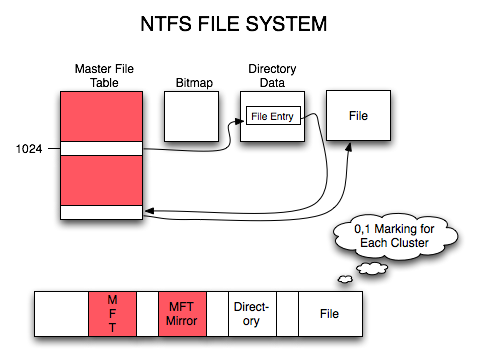

# why

Hard drive have a relatively low life time (5/10 years), recent hard drives integrates more and more security features for data.
i have to restore data from an old hard drive

````
nheim@debian:~/Downloads$ ls -altr /dev/disk/by-id/ata-MAXTOR_STM3500320AS_5QM0X638
lrwxrwxrwx 1 root root 9 Nov 23 01:26 /dev/disk/by-id/ata-MAXTOR_STM3500320AS_5QM0X638 -> ../../sdd
````

partition is still visible in linux but windows fails to read this any more. the filesystem to restore is `NTFS`

## NTFS



### References
- https://www.pandorarecovery.com/blog/ntfs-data-recovery/

## Chkdsk

checking the filesystem integrity is a good idea when the disk has no damages but when the OS is not able to read what it should on the disk, no operation is realy fully safe for data.
The filesystem can be restored but with many files losts in it. So i choosed to keep the drive unmodified first.

## The interface

Windows cannot read the disk with usb interface (usefull kits for mapping IDE/Sata to USB exists) nor the SATA direct connection.

After a try through a virtual machine booted with linux, and mapping into the USB interface i can read the disk partition and mount it ! there are of course still errors in some files because the drive has some damages.

This exemple show that the linux way to access the partitions data, and reading disk is more robust ( ... maybe at a reliability price ?)

## The idea

the drive is continuously disconnecting from the interface (i don't realy know why) but it's always after trying to read unaccessible data.
trying to restore files from a disk like that is a bad idea because you will lost a lot of time for each try on a bad cluster range.
Keeping data more time on this disk mean also take some risks to lost more data !

I think using the disk in a read only way, copying as much data as possible to another disk (or image) on another safe hard drive is a good idea.

## The tool

i'm glad to see that a tool can help me to do this kind of job !
`ddrescue`

```
sudo ddrescue -E10 -i0 -o0 /dev/disk/by-id/ata-MAXTOR_STM3500320AS_5QM0X638 /media/nheim/data2/victoria2/recup /media/nheim/data2/victoria2/log0
```

````
ddrescue --force --pause-on-error=10 -O /dev/disk/by-id/usb-MAXTOR_S_TM3500320AS_000000000033-0:0 /dev/disk/by-id/ata-ST1000LM035-1RK172_ZDEDNEP2  ~/mapfile
````

the `log file` or zone mapping file help us to detect unreadable zones of the disk


